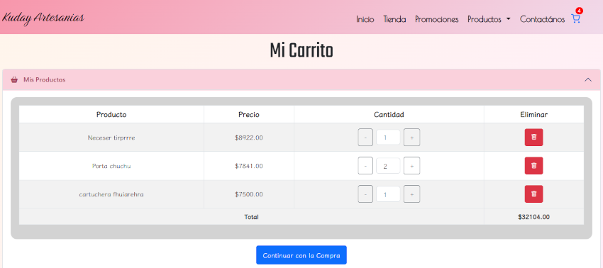
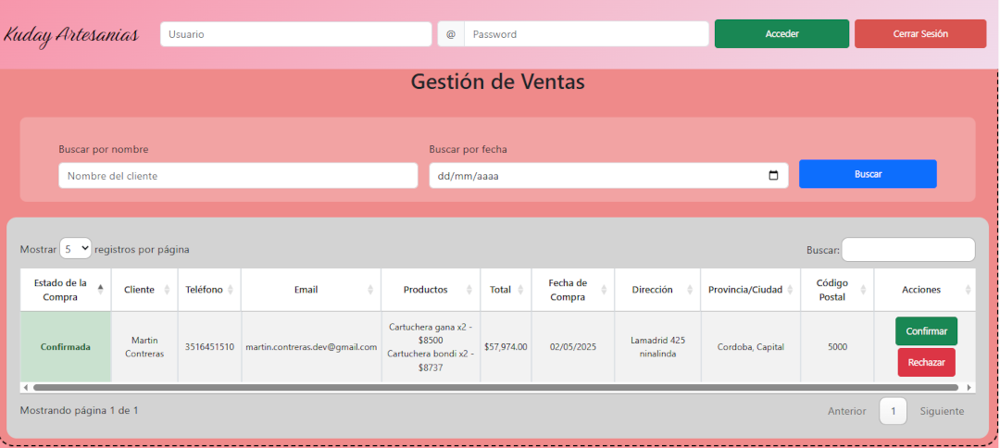

# 🛍️ Kuday Artesanías - Ecommerce PHP

Sistema de comercio electrónico artesanal desarrollado en PHP y MySQL que permite la gestión completa del stock, pedidos, ventas y administración mediante un **panel privado**. El sitio es responsive, dinámico y seguro, con funcionalidades de carrito, contacto, productos y gestión de compras en tiempo real.

---

## 📸 Capturas de Pantalla

| Página Principal | Carrito | Panel Admin |
|------------------|---------|-------------|
|  |  |  |

---

## ⚙️ Tecnologías y Herramientas

- **PHP 8+**
- **MySQL**
- **Composer** (dependencias)
- **PHPMailer** (envío de emails)
- **Bootstrap 5** (diseño)
- **DOMPdf** (generador de PDFs)
- **AOS** (animaciones al hacer scroll)
- **Swiper** (slider de productos)
- **FontAwesome** (iconos)
- **Bootstrap Icons** (iconos)
- **Google Fonts**
- **Dotenv** (gestión de variables de entorno)

---

## 📂 Estructura del Proyecto

```
📦 Kudaystore/
├── componentes/        # Scripts internos PHP para las API Rest y lógica del backend
├── vistas/             # Páginas PHP renderizadas (URL amigables)
├── facturas/           # PDF generados (protegidos por .htaccess)
├── vendor/             # Dependencias Composer (PHPMailer, etc)
├── CSS/                # Estilos CSS3 para el HTML
├── images/             # Imágenes, fondos, patrones
├── screenshots/        # Imágenes de la tienda online
├── .gitignore          # Archivo con directivas para ignorar a otros archivos al subir al repo remoto
├── .env                # Variables de entorno (Archivo ignorado por seguridad)
├── .htaccess           # Reglas de seguridad y redirecciones con linux scripting
├── index.php           # Página principal
├── panel.php           # Panel administrativo
├── producto.php        # Página descriptiva dinámica de cada producto
├── carrito.php         # Carrito de compras con control de stock actualizado en tiempo real
├── contacto.php        # Página de Contacto robusta y con Google ReCAPTCHA v2
├── composer.json               # JSON con las dependencias de PHP instaladas para el proyecto
├── composer.lock               # Archivo contenedor de dependencias, servicios y versiones
├── config.php                  # Carga las variables de entorno del .env utilizando vLucas/Dotenv
├── actualizar_carrito.php      # Maneja Lógica del carrito
├── descargar_pdf.php           # Archivo que maneja lógica para generar y descargar el pdf/comprobante
├── eliminar_producto.php       # Maneja Lógica del Panel administrador
├── modificar_producto.php      # Maneja Lógica del Panel administrador
└── README.md                   # Este archivo
```

---

## 🔐 Variables de Entorno (`.env`) --> En breve subo el archivo de ejemplo para usarlo como demo

Copia el archivo `.env.ejemplodemo` y renómbralo a `.env`. No subas `.env` a GitHub. Ejemplo de contenido:

```env
DB_HOST=localhost
DB_NAME=kuday_db_demotest
DB_USER=root
DB_PASS=secret_demotest

MAIL_HOST=smtp.tudominio.com
MAIL_PORT=587
MAIL_USER=contacto@tudominio.com
MAIL_PASS=clavesupersegura
```

---

## 🚀 Funcionalidades Clave

- 🛒 Sistema de carrito dinámico con validaciones JS y backend
- 📦 Carga y modificación de productos vía panel
- 📬 Formulario de contacto con PHPMailer + reCAPTCHA v2 + honeypot
- 🛡️ `.htaccess` para proteger rutas y archivos sensibles
- 📊 Control de stock en tiempo real conectado a la base de datos
- 🔐 Autenticación segura para acceso al panel de administración
- 🧾 Generación de facturas PDF
- 🔄 Comunicación `fetch` con scripts en `/componentes` usando JSON y sesiones (API Rest)

---

## 🔧 Instalación (Local) y desde consola (shell, bash, terminal, etc)

1. Clonar el repositorio  
   `git clone https://github.com/jahcr1/kudaySTORE.git`

2. Ingresar al proyecto y configurar el entorno  
   `cd kudaySTORE && cp .env.ejemplodemo .env` (En breve pusheo el archivo .env.ejemplodemo al repo, paciencia!)

3. Instalar dependencias con Composer  
   `composer install`

4. Crear base de datos y cargar el dump `database.sql` (La voy a subir en breve)

5. Levantar el proyecto con Apache o localhost (ej: XAMPP, WAMP, Laragon)

6. No te olvides de dejar una STAR, y si querés mejorar algo y/o colaborar con actualizaciones bienvenido sea.

---

## 📝 TODOs o Mejoras Futuras

- [ ] Dashboard de estadísticas para admins
- [ ] Agregar pasarela de pagos (MercadoPago / Stripe)
- [ ] Subida de imágenes con validación por admins
- [ ] Sistema de usuarios con autenticación para compradores
- [ ] API externa para consulta de productos

---

## 🧑‍💻 Autor

**Martín Contreras </jahcr1>**  
Desarrollador Web / Ingeniería Electrónica  
📧 martin.contreras.dev@gmail.com  
🌐 [MiPortfolio.com](https://www.martincontrerasdev.com/)

---

## 📄 Licencia

Este proyecto está bajo la licencia MIT. Consulta el archivo `LICENSE` para más información.

---


---
